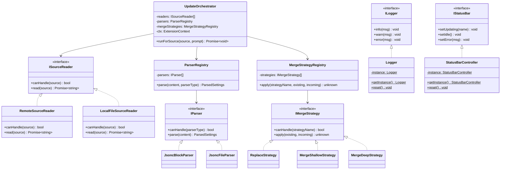
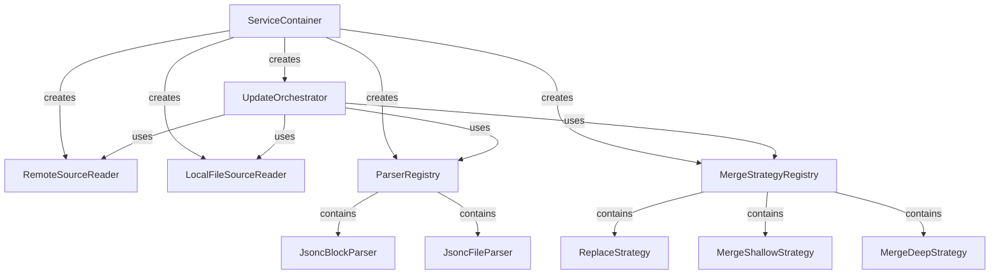
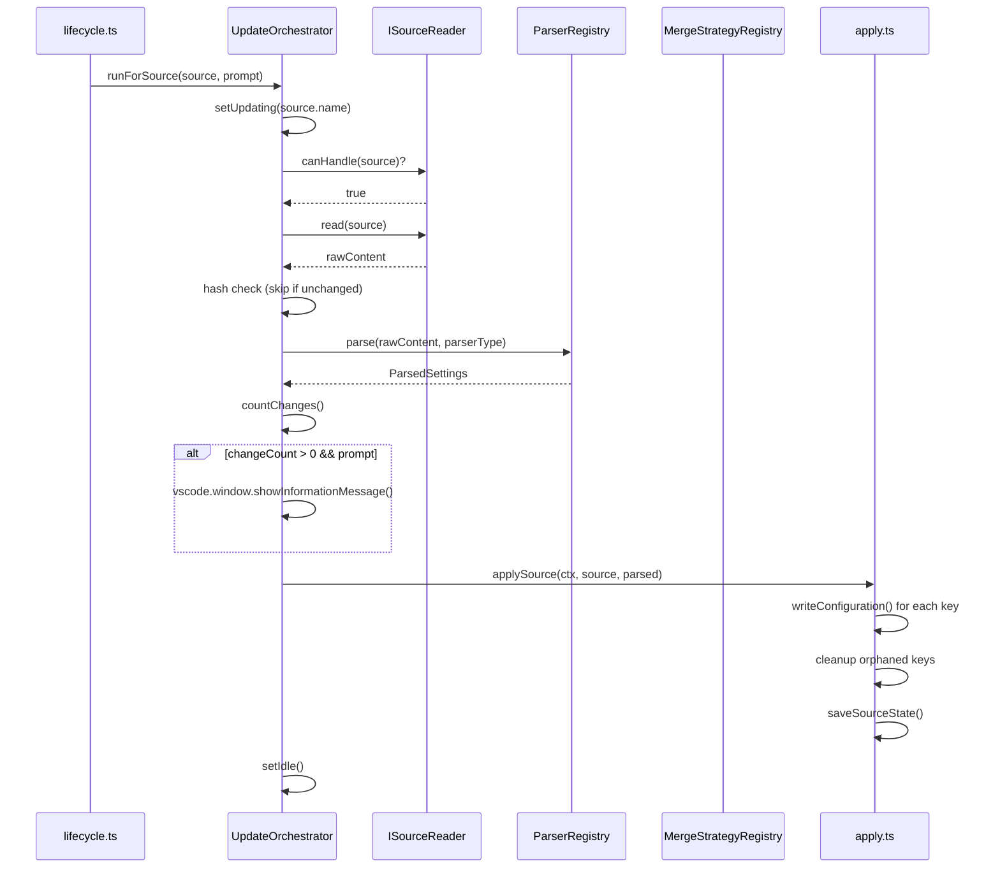

# Architecture

## Overview

This VS Code extension syncs `settings.json` keys from one or more configurable sources (remote URLs or local files). On activation it polls each source on a configurable interval, reads raw content, parses it into a settings record, and writes the resulting keys into the user's VS Code configuration — optionally prompting before applying changes.

The codebase follows a SOLID architecture built around three strategy-pattern axes: **source reading** (`ISourceReader`), **content parsing** (`IParser`), and **value merging** (`IMergeStrategy`). Each axis has a registry that dispatches to the appropriate implementation at runtime, and a `ServiceContainer` acts as a DI factory that wires everything together — making it straightforward to swap implementations or inject mocks in tests.

## Directory Structure

```
src/
├── index.ts               # Extension entry point (activate/deactivate)
├── lifecycle.ts           # Startup polling + backward-compat fetchAndApplySource
├── UpdateOrchestrator.ts  # Core orchestration class
├── ServiceContainer.ts    # DI factory (createProductionServices / createTestServices)
├── apply.ts               # applySource() + countChanges() — VS Code config write
├── state.ts               # Per-source state persistence (hash, applied keys)
├── logger.ts              # ILogger + Logger singleton
├── statusBar.ts           # IStatusBar + StatusBarController singleton
├── commands.ts            # 7 VS Code command registrations
├── sources/
│   ├── types.ts           # Source, SourceState, ParsedSettings, MergeStrategy types
│   ├── ISourceReader.ts   # ISourceReader interface
│   ├── RemoteSourceReader.ts    # HTTP fetch implementation
│   ├── LocalFileSourceReader.ts # vscode.workspace.fs implementation
│   ├── fetcher.ts         # fetchRaw() low-level HTTP
│   ├── resolver.ts        # resolveUrl() shorthand expansion
│   ├── pathResolver.ts    # resolveFilePath() 4-step resolution
│   ├── localWatcher.ts    # FileSystemWatcher for local sources
│   └── parser.ts          # parseContent() backward-compat wrapper
├── parsers/
│   ├── IParser.ts         # IParser interface
│   ├── JsoncBlockParser.ts      # Extracts ```jsonc blocks from markdown
│   ├── JsoncFileParser.ts       # Full JSONC/JSON file parser
│   └── ParserRegistry.ts       # Dispatch by parserType string
└── strategies/
    ├── IMergeStrategy.ts        # IMergeStrategy interface
    ├── ReplaceStrategy.ts       # replace: overwrite
    ├── MergeShallowStrategy.ts  # merge-shallow: Object.assign
    ├── MergeDeepStrategy.ts     # merge-deep: recursive merge
    └── MergeStrategyRegistry.ts # Dispatch by strategyName string
```

## Class Diagram



## ServiceContainer Dependency Graph



## Update Lifecycle



## Extension Points

### Adding a New Source Reader

1. Create a class implementing `ISourceReader` in `src/sources/`
2. Add it to the `readers` array in `ServiceContainer.createProductionServices()`

### Adding a New Parser

1. Create a class implementing `IParser` in `src/parsers/`
2. Pass it to `new ParserRegistry([...existing, new YourParser()])` in ServiceContainer

### Adding a New Merge Strategy

1. Create a class implementing `IMergeStrategy` in `src/strategies/`
2. Pass it to `new MergeStrategyRegistry([...existing, new YourStrategy()])` in ServiceContainer

## Testing Guide

- **Unit tests** (`test/unit/`): Use `vi.mock('vscode', ...)` — no VS Code process needed. Run with `pnpm test`.
- **Integration tests** (`test/integration/`): Require a real VS Code (electron) instance. Run with `pnpm test:integration` (needs display server on Linux: `xvfb-run`).
- **Test services**: Use `createTestServices(ctx, { readers: [mockReader] })` to inject mocks into `UpdateOrchestrator` without touching singletons.
- **Reset singletons** between tests: `Logger.reset()`, `StatusBarController.reset()`.
