# 04 — Merge Strategies

## Overview

Each source declares how its parsed settings object should be merged into the existing
`settings.json`. The merge strategy affects only the keys that the source provides — it never
touches unrelated settings.

---

## Strategy: `replace` (default)

The source value **completely replaces** the existing value for each key it provides.

```
Existing settings.json:              Source provides:
{                                    {
  "explorer.fileNesting.patterns": {   "explorer.fileNesting.patterns": {
    "*.ts": "$(capture).js",             "*.ts": "NEW_VALUE",
    "*.go": "$(capture)_test.go"         "mise.toml": ".mise.toml"
  }                                    }
}                                    }

Result:
{
  "explorer.fileNesting.patterns": {
    "*.ts": "NEW_VALUE",           ← replaced
    "mise.toml": ".mise.toml"      ← added
    // *.go is GONE                ← removed (source didn't include it)
  }
}
```

Use `replace` when the source is the authoritative definition of the entire setting value
(e.g. community pattern lists).

---

## Strategy: `merge-shallow`

Only the **top-level keys** of the source object are written. Existing sub-keys not present in
the source are preserved.

```
Existing settings.json:              Source provides:
{                                    {
  "explorer.fileNesting.patterns": {   "explorer.fileNesting.patterns": {
    "*.ts": "OLD",                       "*.ts": "NEW",
    "*.go": "$(capture)_test.go"         "mise.toml": ".mise.toml"
  }                                    }
}                                    }

Result:
{
  "explorer.fileNesting.patterns": {
    "*.ts": "NEW",                 ← updated (source had this key)
    "*.go": "$(capture)_test.go",  ← PRESERVED (source didn't have it)
    "mise.toml": ".mise.toml"      ← added
  }
}
```

Use `merge-shallow` when the source provides **personal overrides** on top of an already-applied
base layer (e.g. personal patterns merged after community patterns).

---

## Strategy: `merge-deep`

Recursively merges the source into the existing value. For nested objects: deep merge.
For arrays: concatenate (source array appended after existing). For primitives: source wins.

```
Existing settings.json:
{
  "editor.tokenColorCustomizations": {
    "textMateRules": [ { "scope": "comment", "settings": { "foreground": "#888" } } ]
  }
}

Source provides:
{
  "editor.tokenColorCustomizations": {
    "textMateRules": [ { "scope": "keyword", "settings": { "fontStyle": "bold" } } ]
  }
}

Result:
{
  "editor.tokenColorCustomizations": {
    "textMateRules": [
      { "scope": "comment", "settings": { "foreground": "#888" } },  ← preserved
      { "scope": "keyword", "settings": { "fontStyle": "bold" } }    ← appended
    ]
  }
}
```

Use `merge-deep` for team shared settings where you want to layer on top of existing personal
configuration without blowing it away.

---

## Key Tracking and Cleanup

The extension tracks exactly which `settings.json` keys were written by each source, stored in
`ExtensionContext.globalState`:

```typescript
interface SourceState {
  appliedKeys: string[]   // e.g. ["explorer.fileNesting.patterns", "editor.fontSize"]
}
```

### When a key is removed from a source

On the next successful fetch+apply cycle, the extension compares the current source's key set
against the previously tracked `appliedKeys`. Any key that was previously applied but is no longer
in the source is **removed from `settings.json`**.

```
Previously tracked appliedKeys: ["explorer.fileNesting.patterns", "editor.fontSize"]
Current source keys:            ["explorer.fileNesting.patterns"]

→ "editor.fontSize" is removed from settings.json
```

### Safety rules for cleanup

- A key is only removed if **this specific source** was the last writer of it
- If two sources both wrote to the same key, the key is only removed when **both** sources
  drop it (because the remaining source still owns it)
- Cleanup runs at apply time, not at fetch time — the user sees the removal in the "N settings
  will change" prompt count

---

## Override Order Example (multi-source)

```mermaid
flowchart LR
    S1["Source 0\nCommunity patterns\nreplace"] --> MERGE
    S2["Source 1\nPersonal overrides\nmerge-shallow"] --> MERGE
    S3["Source 2\nTeam settings\nmerge-deep"] --> MERGE
    MERGE["🔀 Apply in order\n0 → 1 → 2"] --> SETTINGS["settings.json"]
```



Sources are applied sequentially. Each source reads the **current intermediate state** (not the
original settings.json). This means:

1. Source 0 (`replace`) writes `explorer.fileNesting.patterns` with all community keys
2. Source 1 (`merge-shallow`) reads the state after Source 0 and overlays personal keys
3. Source 2 (`merge-deep`) reads the state after Sources 0+1 and deep-merges team settings

The final `settings.json` reflects all three layers in the correct precedence order.
