# 05 — Update Lifecycle

## Lifecycle Overview

```mermaid
flowchart TD
    START["VS Code starts\n(onStartupFinished)"] --> INIT{{"First run ever?"}}
    INIT -- yes --> APPLY_ALL["Apply all enabled sources\n(no prompt on first run)"]
    INIT -- no --> CHECK_REMOTE["For each remote source:\ncheck if update interval elapsed"]
    CHECK_REMOTE --> FETCH["Fetch remote content"]
    FETCH --> HASH{{"Content hash\nchanged?"}}
    HASH -- no --> SKIP["Skip — nothing changed"]
    HASH -- yes --> PROMPT
    APPLY_ALL --> DONE["Write to settings.json\nUpdate globalState"]

    LOCAL_WATCH["📁 Local file watcher\nfile changed on disk"] --> PROMPT

    POLL["⏱ Polling timer\nper source interval"] --> FETCH

    PROMPT["Show notification:\n'Source X: N settings will change'\nUpdate / Skip this time"] --> USER{{"User choice"}}
    USER -- Update --> WRITE["Write to settings.json\nUpdate globalState\nUpdate content hash"]
    USER -- Skip --> NOOP["Do nothing\nUpdate lastCheckedAt only"]
```



---

## Phase 1: Startup

Triggered by `onStartupFinished` activation event.

```typescript
async function activate(ctx: ExtensionContext) {
  const initialized = ctx.globalState.get('init', false)

  if (!initialized) {
    // First ever run — apply all enabled sources silently (no prompt)
    ctx.globalState.update('init', true)
    await applyAllSources(ctx, { prompt: false })
    return
  }

  // Subsequent startups — check which remote sources are due for update
  for (const source of getEnabledSources()) {
    if (source.file) continue  // local sources handled by file watcher
    const state = getSourceState(ctx, source.name)
    const intervalMs = (source.updateInterval ?? getGlobalInterval()) * 60_000
    if (Date.now() - state.lastFetchAt >= intervalMs) {
      await checkAndPrompt(ctx, source)
    }
  }
}
```

---

## Phase 2: Polling

A repeating timer is registered per remote source using `setInterval` for the shortest update
interval across all sources.

- The timer fires and checks `Date.now() - state.lastFetchAt` against the source's interval
- Only sources whose interval has elapsed are re-fetched
- Timer is cleared on extension deactivation

---

## Phase 3: Local File Watching

Each source with a `file` property registers a `vscode.workspace.createFileSystemWatcher`.
On `onDidChange`:
1. Re-read the local file
2. Parse it
3. Run the same prompt+apply flow as remote sources

On `onDidDelete`:
- Show a warning notification: "Source 'X' file was deleted — previously applied settings kept"
- Do NOT remove applied settings (safety: avoid accidental wipe)

---

## Phase 4: Fetch & Hash Check (remote sources)

```typescript
async function checkAndPrompt(ctx: ExtensionContext, source: Source) {
  const url = resolveUrl(source.url, getConfig('settingsUpdater.giteaBaseUrl'))
  let raw: string
  try {
    raw = await fetchWithTimeout(url, 10_000)
  } catch (e) {
    log.warn(`[${source.name}] Fetch failed: ${e}`)
    return
  }

  const hash = sha256(raw)
  const state = getSourceState(ctx, source.name)
  if (hash === state.lastContentHash) {
    state.lastFetchAt = Date.now()
    saveSourceState(ctx, source.name, state)
    return  // nothing changed
  }

  const parsed = parse(raw, source.parser ?? getConfig('settingsUpdater.defaultParser'))
  await promptAndApply(ctx, source, parsed, state)
}
```

---

## Phase 5: Prompt

The prompt is a VS Code information message notification:

```
[Settings Updater] Source "File Nesting (antfu community)": 3 settings will change.
[ Update ]  [ Skip this time ]
```

- If the user clicks **Update** → proceed to apply
- If the user clicks **Skip this time** → update `lastFetchAt` only (check again next interval)
- If the user dismisses the notification → treated as **Skip**

The count "N settings will change" includes:
- Keys that will be added
- Keys whose values will change
- Keys that will be removed (tracked cleanup)

---

## Phase 6: Apply

```typescript
async function applySource(ctx: ExtensionContext, source: Source, parsed: Record<string, unknown>) {
  const config = vscode.workspace.getConfiguration()
  const state = getSourceState(ctx, source.name)

  // 1. Determine which keys to write
  const keysToWrite = source.targetKey
    ? { [source.targetKey]: parsed[source.targetKey] ?? parsed }
    : parsed

  // 2. Apply merge strategy for each key
  for (const [key, newValue] of Object.entries(keysToWrite)) {
    const existing = config.get(key)
    const merged = applyMerge(existing, newValue, source.mergeStrategy ?? 'replace')
    await config.update(key, merged, vscode.ConfigurationTarget.Global)
  }

  // 3. Clean up keys removed from this source
  const newKeys = Object.keys(keysToWrite)
  const removedKeys = state.appliedKeys.filter(k => !newKeys.includes(k))
  for (const key of removedKeys) {
    // Only remove if no other source still owns this key
    if (!isKeyOwnedByAnotherSource(ctx, key, source.name)) {
      await config.update(key, undefined, vscode.ConfigurationTarget.Global)
    }
  }

  // 4. Update tracked state
  state.appliedKeys = newKeys
  state.lastFetchAt = Date.now()
  state.lastContentHash = hash  // from fetch phase
  saveSourceState(ctx, source.name, state)
}
```

---

## Error Handling Summary

| Error | Effect on settings.json | User notification |
|-------|------------------------|-------------------|
| Network timeout / error | No change | Warning notification |
| Invalid JSONC (parse error) | No change | Error notification with detail |
| No ` ```jsonc ` block found (jsonc-block parser) | No change | Warning notification |
| Local file not found | No change | Warning notification |
| Local file deleted | No change (kept as-is) | Warning notification |
| `settings.json` write error | No change | Error notification |
